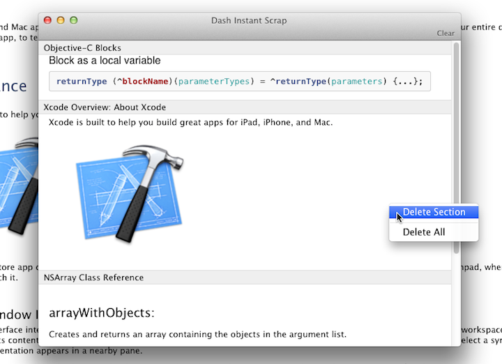

# DashInstantScrap 

DashInstantScrap is SIMBL plugin for [Dash](http://kapeli.com/dash).

This plugin provides a window which stores fragments of document temporary.

"Instant Scrap from Selection" menu item is added to context menu when there is selection. This menu shows Instant Scrap Window and adds selection to a stack of scrap.

"Instant Scrap" menu item is added to "Window" menu. This menu just shows window.

## Install
1. Make sure you have installed [EasySIMBL](https://github.com/norio-nomura/EasySIMBL).
2. Download from [Releases section](https://github.com/hetima/DashInstantScrap/releases).
3. Copy `DashInstantScrap.bundle` to `~/Library/Application Support/SIMBL/Plugins`
   (or drop bundle file to EasySIMBL window).
4. Restart Dash.

## Author
http://hetima.com/  
https://twitter.com/hetima

## License 
MIT License. Copyright (c) 2014 hetima
